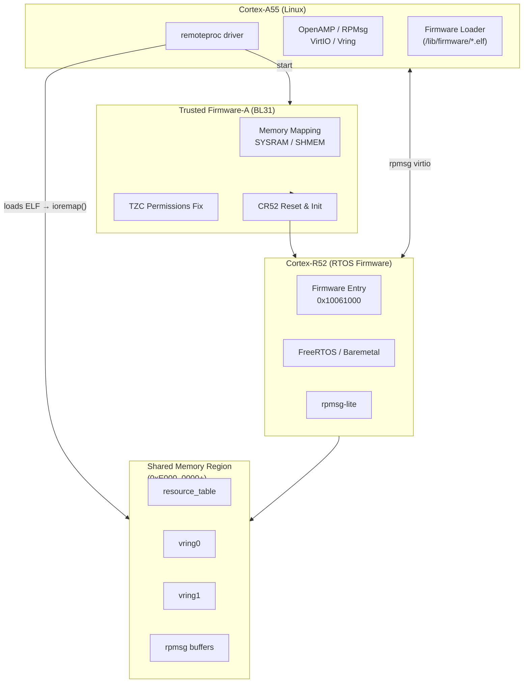
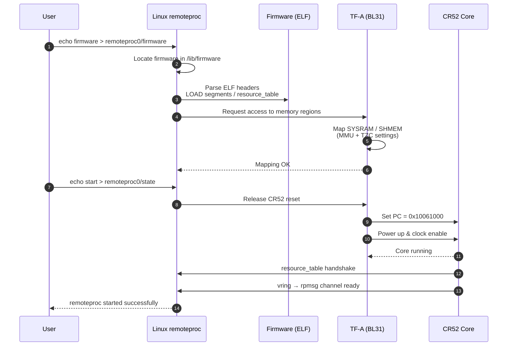
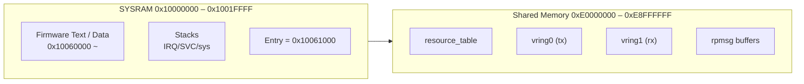

# 📘 **RZ/T2H — Linux Remoteproc 無法啟動 CR52**


# **1. 前言：Linux 想要透過 remoteproc 啟動 CR52**

在 RZ/T2H 系統中：
-   Cortex-A55 執行 Linux
-   Cortex-R52 執行 RTOS / firmware
-   希望從 Linux 啟動 CR52，並透過 OpenAMP / RPMsg 做 IPC
    

Linux 使用標準 remoteproc 控制 flow：
```bash
echo <firmware> > /sys/class/remoteproc/remoteproc0/firmware
echo start        > /sys/class/remoteproc/remoteproc0/state
``` 

但發現：  
**remoteproc 在啟動 CR52 時直接造成 Linux Kernel panic（SError Interrupt）。**

----------

# **2. 觀察到的行為**

在 Linux 上執行：
```bash
echo start > /sys/class/remoteproc/remoteproc0/state
```
Kernel panic log：
```bash
SError Interrupt ... 
pc : vunmap
rz_rproc_start+0x1d0
```
這表示：

### ⚠ Linux remoteproc 正在 `ioremap()` CR52 firmware / vring / resource_table 區域

但該記憶體區域對 Linux **不可存取（Secure only / 未 map）**。

----------

# **3. 根本原因**

分析 CR52 firmware 的 ELF：
```bash
readelf -l firmware.elf` 
```

你發現它的記憶體段包括：

| Segment | Physical address | 用途 |
|---------|-------------------|------|
| LOAD | 0x10060000 〜 | CR52 程式碼（SYSRAM） |
| LOAD | 0xE0000000 | .resource_table |
| LOAD | 0xE1000000 | vring 空間 |

這些位址對於 **remoteproc 是必須 ioremap 的**。

然而，RZ/T2H 的預設 TF-A（BL31）將：
-   `0x10000000`（SYSRAM）
-   `0xE0000000`（OpenAMP/vring）
    
視為 Secure-only 或未納入 translation table。

因此 Linux 在 remoteproc 啟動 CR52 時：
```bash
ioremap(0xE0000000)
→ SError (permission denied / unmapped)
→ Kernel panic
``` 

----------

# **4. 修正方法：擴充 TF-A 記憶體 mapping 讓 Linux 能存取 CR52 firmware 區域**

要讓 Linux 能 read/write：
-   CR52 firmware 程式碼  
-   resource_table
-   vring buffer
    
就必須在 TF-A（BL31）加入 memory mapping。

### ✔ 你的修正：在 BL31 中新增 mapping
``` c
MAP_REGION_FLAT(0x10000000, 0x200000, MT_MEMORY | MT_RW | MT_SECURE),
MAP_REGION_FLAT(0xE0000000, 0x9000000, MT_MEMORY | MT_RW | MT_SECURE),
``` 
這讓 TF-A：
-   為 SYSRAM 建立 translation table
-   將 OpenAMP 共享記憶體區域納入 mapping
-   供 Linux ioremap ()
----------

# **5. 修正方法：增加 translation table 數量**

新增這些 mapping 後 TF-A 原本的：
```c
MAX_XLAT_TABLES 5
MAX_MMAP_REGIONS 7
```
會不足，因此改成：
```c
#define MAX_XLAT_TABLES   20
#define MAX_MMAP_REGIONS  20
```
避免：
-   Page table 不足
-   TF-A 在 early boot 失敗
-   Linux 無法存取 CR52 區域
----------

# **6. 修正方法：放寬 R52 TCM / SYSRAM 權限**

OpenAMP 要求：
-   resource_table
-   vring
-   shared buffer

**必須為 Non-secure / non-privileged**  
才能讓 A55 端 (Linux) 正常存取。

你套用的做法：
```c
.sec_attr = TZC_REGION_S_NONE,
.nsaid_permissions = PLAT_TZC_REGION_ACCESS_NS_UNPRIV
```
這使：
-   CR52 loader 區域
-   OpenAMP IPC 區域
   
可被 Linux 端 remoteproc 安全存取。

----------

# **7. 修正後結果：remoteproc 成功啟動 CR52**

修正後：
``` bash
echo start > /sys/class/remoteproc/remoteproc0/state
```
不再 panic

此時：
-   CR52 以 Linux 指定的 firmware 啟動
-   resource_table 交換成功 
-   vring 建立
-   rpmsg 通道可以生成
----------

# **8. 最終系統架構**
```pgsql
+---------------------------+
|       Linux (A55)         |
|                           |
|  remoteproc + OpenAMP     |
+------------+--------------+
             |
             v
  (Shared memory @ E0xx_xxxx)
  - resource_table
  - vring0, vring1
  - message buffers
             |
             v
+---------------------------+
|       CR52 (RTOS)         |
|  firmware entry 0x10061000|
|  rpmsg / OpenAMP client   |
+---------------------------+
             |
             v
+---------------------------+
|          TF-A BL31        |
| + memory mapping fix      |
| + TZC permission fix      |
| + CR52 reset release      |
+---------------------------+

```
# **9. 系統整體架構圖**


# **10. Remoteproc Boot Flow圖**


# **11Remoteproc Memory Layout**

