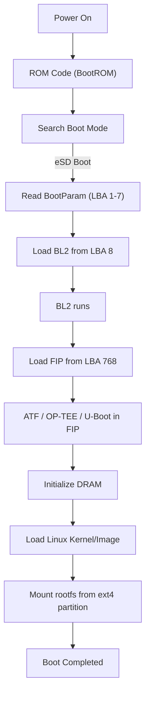

# RZ/T2H SD/eSD 開機 Image 製作與 Debug


# 📘 目錄

1.  背景與目標
2.  RZ/T2H 開機流程與 Bootloader 布局
3.  Yocto WIC Layout 深入分析
4.  使用 fdisk / wic / xxd 比對 Yocto 與自製 image
5.  Debug Problem Timeline
6.  最終 Root Cause 與結論
7.  正確可開機的 image 製作流程
8.  RZ/T2H Boot Flow（eSD Boot）
9.  附錄：對照表、偏移計算、分析工具
    

----------

# 1. 背景與目標

要達成：

-   用以下檔案自行組合出可開機 SD image：
    -   `bl2_bp_esd.bin`
    -   `fip.bin`
    -   `rootfs.tgz`
    -   `Image`
    -   `*.dtb`
    -   `modules/`
        
-   使用 Ubuntu Host 生成完整可開機 SD 卡 image。

在過程中發現：
-   官方 Yocto `.wic` **不只**是 dd 進去
-   Bootloader 的 offset 與 LBA 配置複雜
-   Partition 的 Start sector 與 Align 規則不能亂改
-   BL2_BP 實際寫在 **LBA 1 開始，而非 LBA 0**
-   FIP 必須寫在 **LBA 768**
-   FAT / EXT4 partition 位置需與 WIC 完全一致
----------

# 2. RZ/T2H 開機流程與 Bootloader 佈局

RZ/T2H eSD boot 的 boot chain：
`ROM → BootParam ×7 → BL2 → FIP → U-Boot → Linux` 
### Yocto WIC 實際配置

| Boot component | LBA（sector） | Bytes offset | 說明 |
|----------------|----------------|----------------|----------------|
| BootParam | 1–7 | 0x200–0xE00 | 固定 512 bytes × 7 |
| BL2 | 8 之後 | 0x1000 | 與 BP（bl2_bp_esd.bin）合併 |
| FIP | 768 | 768 × 512 = 0x60000 | 固定位置，由 TF-A 設定 |

🔍 **ROM 不從 LBA0 開始載入 BootParam！而是從 LBA1載入 BootParam。**

----------

# 3. Yocto WIC Layout 深入分析


### 實際輸出 `.wic` 結構（使用 `wic ls`）

| Partition | Start sector | Size | Filesystem |
|-----------|---------------|--------|-------------|
| rawcopy #1 (BL2_BP) | 1 | variable | raw |
| rawcopy #2 (FIP) | 768 | variable | raw |
| p1 | 4096 | 19.7M | FAT32 |
| p2 | 44536 | 約 1.6G | EXT4 |
----------

# 4. 使用 fdisk / wic / xxd 比對 Yocto 與自製 image

## ✔ Yocto `.wic` 檢查

```nginx
fdisk -l core-image*.wic` 
```

→ Start=4096、44536 

```yaml
xxd -s 0 -l 16`：
0x00000000:  fab8  0010 8ed0  bc00  ...
```


→ 前面不是 0，也不是 bl2_bp，表示 Yocto WIC **並沒有把 BL2_BP 放在 LBA0**。

## ✔ 自製 image（錯誤版本）
```yaml
xxd -s 0 -l 16 ubuntu.img
00000000: 0100 0000 0000 0000 ......
``` 

代表：

❌ 把 `bl2_bp_esd.bin`寫到 **LBA0**  
→ ROM 無法找到 BootParam → 無法開機

## ✔ 正確 Yocto 的 BL2_BP offset 查核

```bash
xxd -s $((1*512)) -l 16 wic.img
```
→ 這裡會看到：

```
0100 0000 0000 0000
```
證實：

✔ BootParam 起始 LBA = **1**  
✔ LBA0 不是 bootloader，而是 WIC header

----------

# 5. Debug Problem Timeline

## 🔥 問題 1：不能開機（因為 BL2_BP 寫錯 offset）

一開始的 script：
```bash
dd  if=bl2_bp_esd.bin of=$loop_dev conv=notrunc
```
→ 寫到 LBA0，而不是 Yocto 的 LBA1。

### Root cause：
-   Yocto `.wic` 有 WIC metadata header → 前面不是 empty
-   ROM 不從 LBA0 boot，從 **LBA1** boot
    

----------

## 🔥 問題 2：FIP offset 錯誤

探勘 offset：
```nginx
xxd -s $((768*512)) -l 16 core-image*.wic`
```
→ 發現 FIP 在 LBA 768 → script 修正後正常。

----------

## 🔥 問題 3：你用錯 partition layout

Yocto：
```sql
P1 start=4096
P2 start=44536
```
你最初用：
```ini
start=524288 
```
→ 完全錯 → kernel 找不到 rootfs。

----------

## 🔥 問題 4：rootfs 抽 tar 時空間不足

因為 P2 開太小（用 6GB image 但 rootfs 沒對齊），後來你調整 P2 start 沒問題。

----------

## 🔥 問題 5：mount 後 umount 失敗（busy）

修正 trap/dir remove 後解決。

----------

# 6. 最終 Root Cause 與結論

### ✔ 不能開機的真正原因：

> **你把 BL2_BP 寫到 LBA 0。但 Yocto 寫在 LBA 1。**  
> ROM 只從 LBA1 讀 BootParam → LBA0 完全無作用。

### ✔ Partition layout 需完全符合 Yocto：


| Partition | Start | Type |
|-----------|--------|------|
| P1 | 4096 | FAT32 (0x0c) |
| P2 | 44536 | EXT4 (0x83) |

### ✔ Bootloader offset 必須固定：

| Component | LBA |
|-----------|------|
| BootParam × 7 + BL2 | 1 |
| FIP | 768 |

----------

# 7. 正確可開機的 image 製作流程

1.  建 image
2.  losetup -P
3.  **寫 BL2_BP → LBA1**
4.  **寫 FIP → LBA768**
5.  建 MBR/dos partition table
6.  Partition:
    -   P1: 4096, size=40434, type=c  
    -   P2: 44536, type=83
7.  Format FAT32/ext4
8.  Mount P2 → extract rootfs
9.  Copy kernel/dtb/modules
10.  losetup detach
----------
# 8. RZ/T2H Boot Flow（eSD Boot）


----------

# 9. 附錄：對照表、偏移計算、分析工具

----------

## ✔ Bootloader offset 計算
```ini
LBA1 = 1 * 512 = 0x200
LBA768 = 768 * 512 = 0x60000
```
----------

## ✔ 分析工具指令


| 功能 | 指令 |
|------|------|
| 列出 partition | `fdisk -l image.img` |
| 檢查 Yocto wic | `wic ls foo.wic` |
| 查看 raw offset | `xxd -s OFFSET -l 32 image` |
| 搜尋 BL2 signature | `grep -oba "$(xxd -p -l 8 bl2_bp.bin)" image` |
| 分析檔案結構 | `binwalk image.img` |
