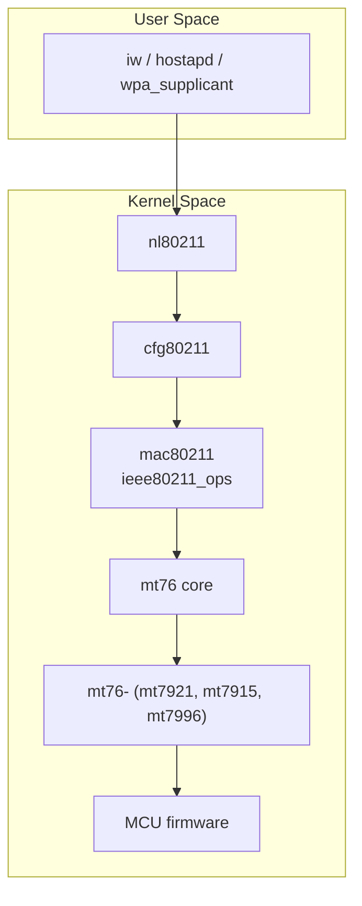

# **第 2 章：整體系統架構**

## 2.1 全域架構圖


----------

## 2.2 最重要的核心資料結構

### **2.2.1 struct mt76_dev**

所有 mt76 裝置的核心物件：
```c
struct mt76_dev {
    struct ieee80211_hw *hw;
    void __iomem *mmio_base;

    struct mt76_queue q_tx[__MT_TXQ_MAX];
    struct mt76_queue q_rx[__MT_RXQ_MAX];

    struct mt76_mcu mcu;

    spinlock_t lock;
    struct mutex mutex;
};
```


功能：

-   TX/RX queue 管理
-   MCU 驅動上下文
-   DMA ring 狀態
-   mac80211 結合（hw）
    

### **2.2.2 struct ieee80211_ops**（由 mt76 實作）

mt76 的核心由以下回調構成：
```c
static  const  struct  ieee80211_ops  mt7915_ops = {
    .start = mt7915_start,
    .stop = mt7915_stop,
    .tx = mt76_mac80211_tx,
    .add_interface = mt7915_add_interface,
    .remove_interface = mt7915_remove_interface,
    .config = mt7915_config,
    .sta_add = mt7915_sta_add,
    .sta_remove = mt7915_sta_remove,
    .set_key = mt7915_set_key,
    .sw_scan = mt76_sw_scan,
};
```

